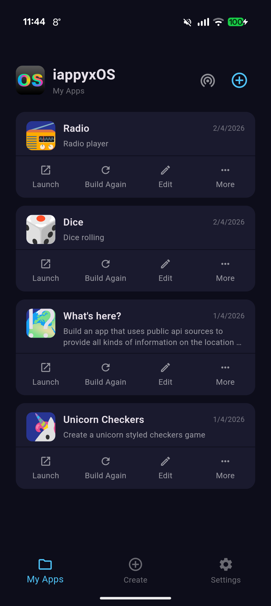
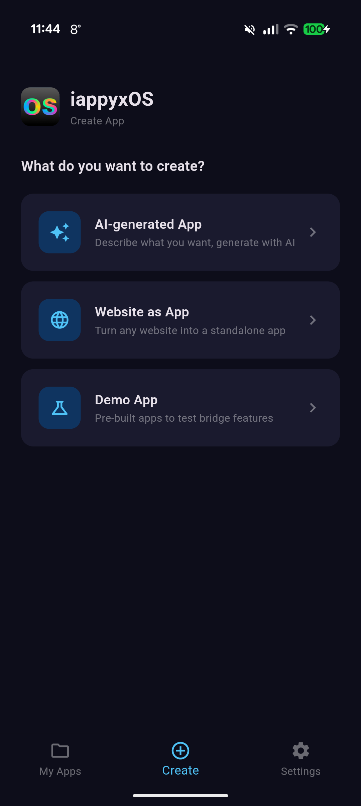
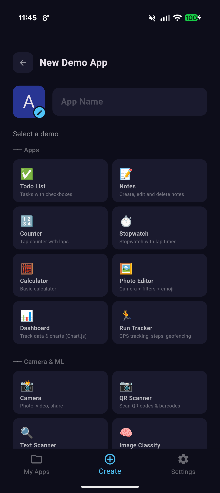
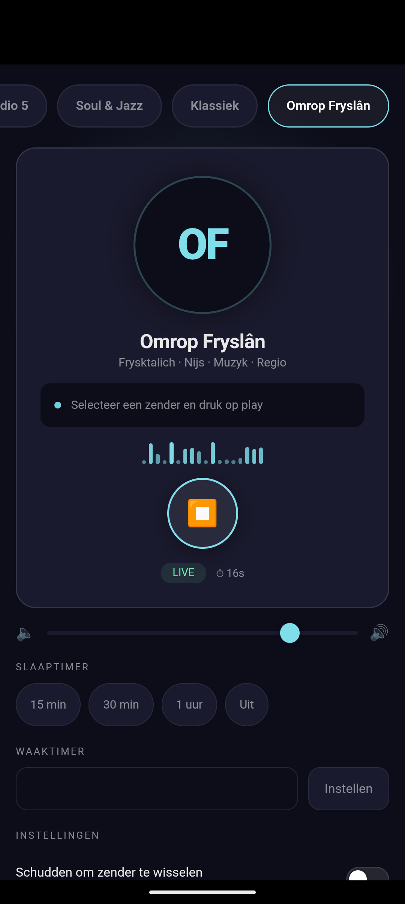
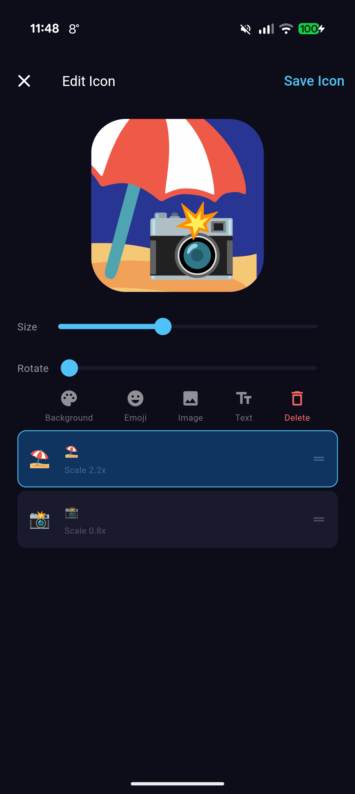
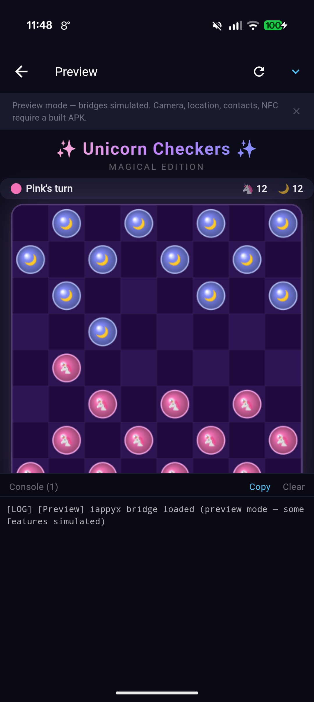

# iappyxOS

**Generate real Android apps on your device — no server, no app store, no code.**

Describe what you want to your favorite AI, and iappyxOS turns it into a real installed APK with its own launcher icon. Building, signing, and installing all happen on-device. No cloud. No subscription. No coding required.

## Screenshots

<p align="center">
  
  
  
  
</p>
<p align="center">
  
  
</p>

*My Apps • Create • 48 Demos • Generated Radio App • Icon Editor • Preview with Console*

## What it does

- **AI-generated App** — describe your app in plain language, let an AI generate the code, preview it, and build
- **Website as App** — turn any website into a lightweight standalone app (1MB, no bridges, sandboxed)
- **Demo Apps** — 48 pre-built apps to test native bridges (camera, GPS, NFC, sensors, audio, SQLite, and more)

Every generated app is a real signed APK that appears in your Android launcher. You can share it, uninstall it, or update it — just like any app.

## How it works

```
┌─────────────────────────────────────┐
│         STANDARD LAUNCHER           │
│   App 1 🎯   App 2 📍   App 3 📷   │
└──────────────┬──────────────────────┘
               │ real installed APKs
┌──────────────▼──────────────────────┐
│         GENERATED APP SHELL         │
│  WebView + native bridge layer      │
│  HTML/JS injected as assets         │
└──────────────┬──────────────────────┘
               │ created and signed by
┌──────────────▼──────────────────────┐
│       CONTAINER APP (iappyxOS)      │
│  AI prompt → HTML → APK injection   │
│  → manifest patching → v2 signing   │
│  → PackageInstaller                 │
└─────────────────────────────────────┘
```

1. User describes an app (or picks a template, or enters a URL)
2. HTML/JS is injected into a pre-built WebView shell APK
3. The Android manifest is binary-patched with a unique package name
4. The APK is signed on-device using the Android Keystore (hardware-backed)
5. The system installer dialog appears — the app shows up in the launcher

## Features

- **AI generation** — automatic via API (Anthropic, OpenRouter) or manual copy-paste to any AI
- **55+ native bridges** — camera, location, sensors, audio, notifications, NFC, biometric, SQLite, contacts, SMS, calendar, clipboard, TTS, screen, vibration, alarms, media gallery, download manager, compass, wallpaper, audio focus, and more
- **Icon editor** — emoji, text, images, custom colors, rotation, multiple layers
- **App management** — launch, rebuild, edit, share (APK or HTML), uninstall
- **P2P sharing** — share built apps directly between devices via WiFi Direct
- **Preview** — test your app in a WebView with live JS console and simulated bridges before building
- **Offline-first** — everything except AI generation works in airplane mode
- **Configurable** — custom system prompt, app ID prefix, multiple AI providers

## Quick start

1. [Download the latest Beta](bin/iappyxOS.apk?raw=true)
2. Sideload on Android 10+ (enable "Install unknown apps" for your browser)
3. Open iappyxOS → Create → pick a mode → build

**AI generation (two options):**
- **Automatic** — add your API key in Settings (Anthropic or OpenRouter), then tap "Generate" in the Create flow
- **Manual** — copy the generated prompt, paste it into any AI chat (Claude, ChatGPT, Gemini, etc.), paste the HTML back, preview, build

## Native bridges

Generated apps access device hardware through a JavaScript bridge (`window.iappyx`):

| Bridge | What it does |
|--------|-------------|
| Storage | Key-value persistence, file storage, save to Downloads, share files |
| Camera | Photo, video, QR/barcode scan, OCR text scan, ML image classification, background removal |
| Location | GPS single shot, continuous tracking, foreground service, geofencing |
| Sensors | Accelerometer, gyroscope, magnetometer, compass heading, proximity, light, pressure, step counter |
| Audio | Play/pause/seek/loop, record, speech-to-text, media session (lock screen controls), sound effects, audio focus |
| Notifications | Send with actions, schedule, repeating, badge count, cancel |
| NFC | Read tags, write NDEF text/URI |
| SQLite | Full SQL database with transactions |
| Biometric | Fingerprint/face authentication |
| TTS | Text-to-speech with language, pitch, rate, completion callback |
| Contacts | Read device contacts (name, phone, email) |
| SMS | Send SMS messages |
| Calendar | Read/add calendar events |
| Clipboard | Read/write, monitor changes |
| Screen | Keep on, brightness, wake lock |
| Vibration | Patterns, haptic feedback (click, tick, heavy) |
| Alarms | Exact and repeating alarms (fire even when app is closed) |
| Share | Photos, text, files via share sheet; receive shared content from other apps |
| Device | Info, connectivity, torch, print, wallpaper, DND, shortcuts, dark mode |
| Media | Browse gallery (photos/videos/music), pick images, save to gallery, get metadata |
| Download | Queue file downloads with progress, survives app close |
| Capabilities | Query available bridges and permissions at runtime |

## Building from source

### Prerequisites
- Android SDK
- Flutter 3.x
- Java 17+

### Quick build
```bash
./build.sh
# Output: bin/iappyxOS.apk (auto-installs if device connected)
```

### Manual build
```bash
# Shell APK (the template injected into generated apps):
cd src/shell_apk && ./gradlew assembleRelease
cp app/build/outputs/apk/release/app-release.apk ../container_app/assets/shell_template.apk

# Container app (iappyxOS itself):
cd src/container_app && flutter pub get && flutter build apk --release
```

> **Note:** Release builds require a signing keystore. Without `key.properties`, the build falls back to debug signing. See [Signing](#signing) below.

### Signing

The release APK is signed with a private keystore (not in this repo). To set up your own:

```bash
keytool -genkey -v -keystore iappyxos-release.jks -keyalg RSA -keysize 2048 -validity 10000 -alias iappyxos
```

Create `src/container_app/key.properties`:
```
storePassword=YOUR_PASSWORD
keyPassword=YOUR_PASSWORD
keyAlias=iappyxos
storeFile=../../iappyxos-release.jks
```

Both files are gitignored. Never commit your keystore or passwords.

## FAQ

See [FAQ.md](FAQ.md) for answers to common questions — including the hard ones like "isn't this just a WebView wrapper?" and "why is it called OS?"

## License

MIT

## Support

If you find iappyxOS useful, consider [buying me a coffee](https://ko-fi.com/iappyx).
